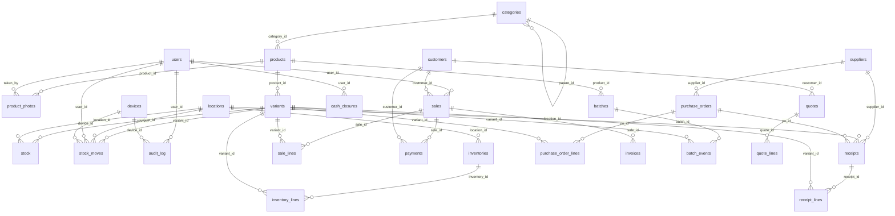

# 🗄 Nursera — Schéma de base de données

> Version 2.5 (schéma v17) · 16/07/2026 · Réf. : [02-specifications-techniques.md](02-specifications-techniques.md) §3
> **Document vivant** : décrit le schéma **réellement implémenté** (migrations appliquées). Les tables planifiées mais non encore créées sont listées en fin de document.

---

## 1. Conventions

| Convention | Règle |
|---|---|
| Moteur | SQLite 3, `journal_mode=WAL`, `foreign_keys=ON`, `busy_timeout=5000` (appliqués à chaque ouverture par `DatabaseManager`) |
| Montants | `INTEGER` en **millimes** (RT-01) — mappés sur le type C++ `Money`, jamais de `REAL` |
| Booléens | `INTEGER` 0/1 (`active`, `revoked`, `is_main`…) |
| Dates | `TEXT` ISO-8601 en **UTC** (`datetime('now')`), affichage en heure locale côté app (RT-02) |
| Bilinguisme | Colonnes doublées `name_fr` / `name_ar` ; `name_fr` obligatoire, `name_ar` nullable avec repli à l'affichage (RT-03) |
| Suppression | **Jamais de DELETE** sur une entité référencée : colonne `active` (RT-04) |
| Identités | `id INTEGER PRIMARY KEY AUTOINCREMENT` local + colonne `uuid TEXT UNIQUE` sur les **faits synchronisables** (mouvements, événements) — identité de sync inter-appareils (doc 02 §3.2) |
| Versionnage | `PRAGMA user_version` = numéro de la dernière migration appliquée |

### Cycle de vie d'une migration

1. Créer `libs/core/migrations/NNN_description.sql` (NNN = `user_version` cible, 3 chiffres).
2. La déclarer dans `libs/core/CMakeLists.txt` (bloc `qt_add_resources`).
3. Règles d'écriture : une instruction par `;`, commentaires en lignes `--` **sans point-virgule** (le parseur de `DatabaseManager::applyMigrations()` découpe sur `;`).
4. Une migration appliquée ne se modifie **jamais** — toute correction passe par une nouvelle migration.
5. Le test `tst_database` vérifie l'application ; ajouter les assertions sur les nouvelles tables.

---

> **M10 Rapports** (ventes par période/catégorie/paiement, valorisation stock à CMP, pertes) est **en lecture seule** sur les tables existantes (`sales`, `sale_lines`, `payments`, `stock`, `variants`, `categories`, `batch_events`) — aucune table ni migration ajoutée.

## 2. Vue d'ensemble (schéma v17 — migrations 001 à 017)

Trois familles :
- **Référentiel** : `categories`, `products`, `variants`, `product_photos`, `locations` — données maîtres, éditées au desktop, répliquées vers le mobile.
- **Faits** : `stock_moves` (additifs immuables — le stock est la *conséquence* des mouvements), `audit_log`.
- **Socle** : `users`, `devices`, `settings`, `doc_counters`.

---

## 3. Tables — détail

### 3.1 Socle

#### `users` — comptes utilisateurs (M01)
| Colonne | Type | Contraintes | Description |
|---|---|---|---|
| `id` | INTEGER | PK auto | |
| `username` | TEXT | NOT NULL, UNIQUE | Identifiant de connexion |
| `display_name` | TEXT | NOT NULL | Nom affiché (écran de sélection) |
| `role` | TEXT | CHECK ∈ `manager`, `seller`, `worker` | Gérant / Vendeur / Ouvrier (F01-02) |
| `pin_hash` | TEXT | nullable | Hash Argon2id du PIN (jamais en clair) |
| `pwd_hash` | TEXT | nullable | Mot de passe complet optionnel (Gérant) |
| `lang` | TEXT | CHECK ∈ `fr`, `ar`, défaut `fr` | Langue d'interface par utilisateur (F11-03) |
| `active` | INTEGER | défaut 1 | Désactivation, jamais de suppression (RG-01.b) |
| `created_at` | TEXT | défaut `datetime('now')` | |

#### `devices` — appareils appairés (F09-09, F11-05)
| Colonne | Type | Description |
|---|---|---|
| `id` | INTEGER PK | |
| `name` | TEXT NOT NULL | « Tablette serre », « PC caisse »… |
| `kind` | TEXT CHECK ∈ `desktop`, `mobile` | |
| `token_hash` | TEXT NOT NULL | Hash du jeton d'appareil (256 bits, doc 02 §4.2) |
| `last_sync_at` | TEXT nullable | Dernière synchronisation réussie |
| `revoked` | INTEGER défaut 0 | Révocation d'un appareil perdu |

#### `settings` — paramètres clé/valeur (M11)
`key TEXT PRIMARY KEY`, `value TEXT`. Clés en service : `company.name/tagline/address/phone/tax_id` (F11-01, alimentent les tickets), `backup.last_day` (garde-fou de la sauvegarde quotidienne, F11-04). À venir : taux de TVA, timbre fiscal, plafonds de remise.

> **Sauvegardes** (`BackupService`, F11-04) : hors schéma — `VACUUM INTO backups/nursera-AAAAMMJJ-HHMMSS.db`, `PRAGMA integrity_check` sur le fichier produit, rotation 30 jours, automatique 1×/jour au démarrage.

#### `doc_counters` — numérotation sans trou (RG-04.b)
`(kind, year)` PK composite, `next_number` — incrémenté **dans la même transaction** que l'insertion du document (tickets `T-`, factures `F-`, avoirs `AV-`, lots `L-`).

#### `audit_log` — journal d'audit (F01-06)
`user_id`, `device_id`, `entity`, `entity_id`, `action`, `details_json`, `created_at` — toute écriture sensible.

### 3.2 Référentiel catalogue (M02)

#### `categories` — hiérarchie à 2 niveaux (F02-02)
| Colonne | Type | Description |
|---|---|---|
| `id` | INTEGER PK | |
| `parent_id` | INTEGER FK→categories | NULL = catégorie racine |
| `name_fr` / `name_ar` | TEXT | Bilingue, FR obligatoire |
| `sort_order` | INTEGER défaut 0 | Ordre d'affichage |
| `active` | INTEGER défaut 1 | |

> Pré-remplie par la migration 002 avec les 10 catégories racines de l'annexe A (doc 01) — modifiable via F11-06.

#### `products` — fiche produit (F02-01, F02-05)
| Colonne | Type | Description |
|---|---|---|
| `id` | INTEGER PK | |
| `category_id` | INTEGER FK→categories | |
| `name_fr` / `name_ar` | TEXT | Nom commercial bilingue |
| `botanical_name` | TEXT | Nom latin |
| `type` | TEXT CHECK ∈ `plant`, `goods` | Plante ou article (pots, terreau… — F02-08) |
| `description_fr` / `description_ar` | TEXT | |
| `sun` | TEXT | Exposition (soleil / mi-ombre / ombre) |
| `water_need` | INTEGER | Besoin en eau 1-3 |
| `hardiness` | TEXT | Rusticité |
| `flowering_period` / `planting_period` | TEXT | Périodes (mois) |
| `adult_height` | TEXT | Hauteur adulte |
| `active` | INTEGER défaut 1 | RG-02.a : jamais supprimé si référencé |
| `created_at` | TEXT | |

Index : `idx_products_category(category_id)`. `type='goods'` couvre la jardinerie (outillage, motoculture, phytosanitaires, engrais, arrosage) — première classe au même titre que les plantes. Recherche produit et caisse couvrent **nom FR/AR, nom latin, SKU et code-barres** (scan des articles).

#### `variants` — conditionnements (F02-03, F02-04)
Le **grain de vente et de stock** : chaque produit se décline en variantes (godet, pot Ø14, motte…), chacune avec son prix et son stock.

| Colonne | Type | Description |
|---|---|---|
| `id` | INTEGER PK | |
| `product_id` | INTEGER FK→products NOT NULL | |
| `sku` | TEXT NOT NULL UNIQUE | Généré `PNNNN-CONDITIONNEMENT` si non fourni (RG-02.b) |
| `barcode` | TEXT nullable | EAN douchette |
| `packaging` | TEXT NOT NULL | godet, pot10, pot14, motte, racines nues… |
| `price_ttc` | INTEGER (millimes) | Prix de vente TTC |
| `price_pro_ttc` | INTEGER nullable | 2ᵉ tarif professionnel (NULL = pas de tarif pro) |
| `vat_rate` | INTEGER | Taux TVA en % : 0 / 7 / 13 / 19 |
| `avg_cost` | INTEGER (millimes) | Coût moyen pondéré (F03-09), recalculé aux réceptions |
| `alert_threshold` | INTEGER nullable | Seuil d'alerte stock (F03-05), NULL = pas de seuil |
| `active` | INTEGER défaut 1 | |

Index : `idx_variants_product(product_id)`.

#### `product_photos` (F02-01, F09-06)
`product_id` FK, `file_path` (photos sur disque, la base ne stocke que le chemin — doc 02 §3.2), `is_main`, `taken_at`, `taken_by` FK→users. **V1** : un seul cliché principal par produit ; l'image choisie est **redimensionnée ≤ 1600 px et ré-encodée JPEG** (EXIF nettoyé) dans `%APPDATA%/…/photos/{uuid}.jpg`. La recherche produit remonte le chemin de la photo principale pour les vignettes.

### 3.3 Stock (M03)

#### `locations` — emplacements (F03-01)
`name_fr`/`name_ar`, `kind` CHECK ∈ `greenhouse` (serre), `field` (parcelle), `sales_area` (zone de vente), `warehouse` (dépôt), `active`.

#### `stock` — quantités courantes (F03-02)
| Colonne | Type | Description |
|---|---|---|
| `variant_id` | INTEGER FK→variants | PK composite |
| `location_id` | INTEGER FK→locations | PK composite |
| `qty` | INTEGER | Peut être **négatif** (RG-03.b — signalé, jamais bloquant) |

> Table de **projection** : elle matérialise la somme des mouvements pour la performance des lectures. La vérité comptable reste `stock_moves`.

#### `stock_moves` — mouvements, faits additifs immuables (F03-03, RG-03.a)
| Colonne | Type | Description |
|---|---|---|
| `id` | INTEGER PK | |
| `uuid` | TEXT NOT NULL UNIQUE | Identité de sync — idempotence du push mobile (doc 02 §5.1) |
| `variant_id` | INTEGER FK NOT NULL | |
| `kind` | TEXT CHECK ∈ `in`, `out`, `transfer`, `adjust` | Entrée / sortie / transfert / ajustement d'inventaire |
| `from_location_id` / `to_location_id` | INTEGER FK nullable | `in` : to seul · `out` : from seul · `transfer` : les deux (différents) · `adjust` : exactement un (to = écart positif, from = écart négatif) |
| `qty` | INTEGER NOT NULL | Toujours strictement positive ; le sens vient de `kind`. Ces invariants sont validés par `SqliteStockRepository::recordMove` |
| `reason` | TEXT | Motif libre |
| `loss_reason` | TEXT | Motif de perte typé (F03-08) : mortality, breakage, disease, frost… |
| `ref_kind` / `ref_id` | TEXT / INTEGER | Document d'origine : `sale`, `sale_cancel` (contre-mouvement d'annulation F04-08, uuid v5 déterministe), `purchase`, `inventory`, `batch` |
| `note` | TEXT | |
| `user_id` / `device_id` | INTEGER FK | Traçabilité F01-04 |
| `created_at` | TEXT | Horodaté **à la saisie**, pas à la sync (RG-09.a) |
| `synced_at` | TEXT nullable | |

Index : `idx_stock_moves_variant(variant_id, created_at)`, `idx_stock_moves_created(created_at)`.
**Annulation = mouvement inverse**, jamais d'UPDATE/DELETE (RG-03.a).

#### `inventories` — inventaires guidés (F03-06, RG-03.c)
| Colonne | Type | Description |
|---|---|---|
| `id` | INTEGER PK | |
| `uuid` | TEXT NOT NULL UNIQUE | Sert aussi de graine aux uuid v5 des ajustements |
| `location_id` | INTEGER FK→locations NOT NULL | Un inventaire = un emplacement |
| `status` | TEXT CHECK ∈ `draft`, `validated`, `cancelled` | Un seul `draft` par emplacement (repris, jamais dupliqué) |
| `started_by` / `validated_by` | INTEGER FK→users | |
| `started_at` / `validated_at` | TEXT | |
| `note` | TEXT | |

#### `inventory_lines`
`(inventory_id, variant_id)` PK composite, `qty_expected` (théorique **figé au démarrage** depuis la projection `stock`), `qty_counted` (NULL = non compté).

**Validation** : chaque ligne comptée avec écart génère un mouvement `adjust` dont l'uuid est **déterministe** — `uuidv5(ns, "uuidInventaire:variantId")`. Une re-validation après échec partiel ne double donc jamais un ajustement (même mécanique d'idempotence que la sync). Les lignes non comptées sont ignorées (inventaire partiel). Après validation, l'inventaire est verrouillé : plus de comptage, plus d'annulation.

### 3.4 Ventes (M04)

#### `sales` — entête de vente comptoir
| Colonne | Type | Description |
|---|---|---|
| `id` / `uuid` | INTEGER PK / TEXT UNIQUE | uuid = identité de sync |
| `number` | TEXT NOT NULL UNIQUE | `T-AAAA-NNNNN`, **sans trou** : réservé dans `doc_counters` au sein de la transaction de la vente (RG-04.b) — une vente refusée ne consomme pas de numéro |
| `status` | TEXT CHECK ∈ `completed`, `cancelled` | Annulation par le Gérant [V1] |
| `subtotal` / `discount` / `vat_total` / `total` | INTEGER (millimes) | `vat_total` = TVA contenue dans le TTC, calculée ligne à ligne |
| `paid_total` | INTEGER | = total en V0 (paiement partiel/crédit avec M06) |
| `user_id` / `device_id` | FK | Vendeur qui encaisse (F01-04) |
| `created_at` / `cancelled_at` / `cancel_reason` | TEXT | |

#### `sale_lines` — lignes figées (snapshot)
`sale_id` FK, `variant_id` FK, `label_snapshot` (le libellé au moment de la vente — les fiches évoluent), `qty`, `unit_price` (millimes), `vat_rate`, `discount_bp`, `line_total`.

#### `payments`
`uuid` UNIQUE, `sale_id` FK, `method` CHECK ∈ `cash`, `cheque`, `transfer`, `amount`, `cheque_number`/`cheque_bank`/`cheque_due`, `user_id`, `created_at`. Table séparée : prépare le paiement mixte (F04-03) et les règlements d'encours clients (M06).

**Transaction unique** (`SqliteSaleRepository::record`) : numéro + entête + lignes + **sorties de stock** (`recordMove(ownTransaction=false)`, `ref_kind='sale'`) + paiement — tout ou rien.

**Annulation** (F04-08) : le jour même, motif obligatoire — contre-mouvements `sale_cancel` (uuid v5 déterministes, rejeu sans double) + `status='cancelled'` dans la même transaction. Les paiements d'une vente annulée sont **neutralisés** dans l'encours client et les totaux du jour (filtres sur `sales.status`).

**Tarif pro** (RG-04.c) : un client `professional` rattaché au panier bascule les lignes sur `variants.price_pro_ttc` (re-tarification en mémoire, non persistée jusqu'à l'encaissement). **Négociation sur place** (F04-01) : le prix unitaire d'une ligne est modifiable directement au panier ; un prix négocié à la main est prioritaire et n'est pas écrasé par la bascule tarif pro. Le prix figé dans `sale_lines.unit_price` est le prix effectivement pratiqué.

#### `credit_notes` — avoirs / notes de crédit (norme comptable)
Une vente ne se **supprime jamais** (numérotation sans trou = exigence fiscale) : après le jour même, elle se **contre-passe** par un avoir. `number` UNIQUE `AV-AAAA-NNN` (doc_counters kind=`credit_note`), `sale_id` UNIQUE (**un seul avoir — total — par vente en V1**), `reason` NOT NULL, `restock` (la marchandise revient en stock → ré-entrées `ref_kind='credit_note'` à uuid v5 déterministes), `refund_method` CHECK ∈ `cash`/`cheque`/`transfer`/`credit`. Effets : `refund_method='credit'` **réduit l'encours client** (kBalanceExpr) ; `refund_method='cash'` **sort du théorique de la clôture de caisse du jour**. Refusé sur une vente annulée. Le journal du jour affiche le badge « Avoir AV-… ».

**Suppression du référentiel (norme)** : une fiche client / produit / fournisseur **jamais référencée** par aucune transaction (ajout fautif) peut être supprimée physiquement (`isReferenced` + `remove`, garde-fou en base). Dès la première référence : désactivation uniquement.

#### `cash_closures` — clôture de caisse (F04-09)
`uuid` UNIQUE, `closed_at`, `expected_cash` (total espèces théorique du jour), `counted_cash`, `gap` (compté − théorique), `user_id`. L'écart est **journalisé** même s'il est nul.

### 3.8 Production & culture (M08)

#### `batches` — lots de production (F08-01)
| Colonne | Description |
|---|---|
| `uuid` UNIQUE / `number` UNIQUE | `L-AAAA-NNN` sans trou |
| `product_id` FK | plante produite |
| `origin` CHECK ∈ `seed`, `cutting`, `division`, `young_plant` | semis / bouturage / division / jeune plant acheté |
| `qty_initial` / `qty_remaining` | le restant décroît aux pertes et passages vendables |
| `location_id` FK | serre/parcelle de culture |
| `status` CHECK ∈ `growing`, `closed` | clôturé automatiquement quand `qty_remaining = 0` |

#### `batch_events` (F08-02)
`uuid` UNIQUE, `batch_id` FK, `kind` CHECK ∈ `loss`, `sellable`, `qty`, `variant_id`/`to_location_id` (destination si vendable), `loss_reason` (mortality/disease/frost/breakage/other), `note`, `user_id`.

**Invariant** (RG-08.b) : `qty_initial = qty_remaining + Σ pertes + Σ vendables` — garanti par `consumeRemaining` qui refuse de consommer au-delà du restant. **Hors stock commercial** tant qu'il n'est pas vendable (RG-08.a) : le passage en `sellable` crée une **entrée de stock** `ref_kind='batch'` (variant × emplacement) dans la même transaction. Taux de survie = (initial − pertes) / initial.

### 3.5 Clients & créances (M06)

#### `customers`
| Colonne | Type | Description |
|---|---|---|
| `id` | INTEGER PK | |
| `kind` | TEXT CHECK ∈ `individual`, `professional` | Particulier / professionnel (F06-01) |
| `name` | TEXT NOT NULL | Nom ou raison sociale |
| `phone` / `phone2` / `email` / `address` | TEXT | Doublon détecté sur `phone` à la création (F06-04) |
| `tax_id` | TEXT | Matricule fiscal (pro) |
| `lang` | TEXT ∈ `fr`, `ar` | Langue des documents |
| `credit_limit` | INTEGER nullable (millimes) | NULL = pas de plafond (RG-06.b) |
| `notes` / `active` / `created_at` | | RG-06.a : désactivation, pas de suppression |

**Encours** (F06-03) — calculé, jamais stocké :
`SUM(sales.total WHERE customer_id AND completed) − SUM(payments.amount WHERE customer_id)`.
Invariant : **tout paiement lié à un client porte `customer_id`** (vente comptant du client, ou règlement d'encours avec `sale_id NULL`).

**Colonnes ajoutées par la migration 006** : `sales.customer_id` (nullable — vente de passage F04-04) et `payments.customer_id`.

**Vente à crédit** (F04-05) : `paid_total = 0`, aucun paiement inséré, le total alimente l'encours. Le **plafond** est contrôlé dans la transaction de la vente (encours + total ≤ plafond, RG-06.b).

### 3.6 Factures (M05)

#### `invoices` (F05-03/04)
| Colonne | Description |
|---|---|
| `uuid` UNIQUE / `number` UNIQUE | `F-AAAA-NNNNN` sans trou (doc_counters kind='invoice') |
| `kind` CHECK ∈ `invoice`, `credit_note` | avoir en V1 |
| `sale_id` FK | la facture est émise depuis une vente ; ses lignes = `sale_lines` |
| `customer_id` FK + `customer_name`/`customer_tax_id` | snapshot client |
| `subtotal_ht`, `vat_total`, `stamp_duty`, `total` (millimes) | `total = TTC vente + timbre` |
| `issued_at`, `pdf_path` | |

#### `quotes` / `quote_lines` — devis (M05, F05-01/02)
`quotes` : `uuid`/`number` (`D-AAAA-NNNNN` sans trou), `customer_id` nullable + `customer_name` (snapshot — devis pour prospect possible), `status` CHECK ∈ `draft`/`sent`/`accepted`/`refused`/`expired`, `subtotal`/`discount`/`total`, `valid_until` (30 j par défaut), `note`, `pdf_path`. `quote_lines` : `variant_id` **nullable** (NULL = ligne libre / prestation d'aménagement), `label`, `qty`, `unit_price`, `line_total`. **Un devis ne touche jamais le stock** (RG-05.b). PDF A4 avec montant en lettres.

#### `invoices` (F05-03/04)

**Émission** (`SqliteInvoiceRepository::createFromSale`) : idempotente — **une seule facture par vente** (re-appel = retourne l'existante). HT = TTC vente − TVA. Rejetée si la vente est annulée. Le **récap TVA par taux** est recalculé au rendu en proratisant la remise globale sur les lignes (réconciliation exacte avec le total). **Montant en lettres** via `AmountToWords` (français, dinars/millimes — `libs/core/src/common`, testé exhaustivement). Timbre fiscal paramétrable (`finance.stamp_duty`, défaut 1,000 DT).

### 3.7 Fournisseurs & achats (M07)

#### `suppliers` (F07-01)
`name` NOT NULL, `phone`, `email`, `address` (adresse exacte), `tax_id`, `payment_terms`, `notes`, `supplies` (produits/services que le fournisseur peut fournir — texte libre, ajouté en 014), `latitude`/`longitude` (REAL nullable, ajoutés en 014 — **préparation de la localisation sur carte**, feature future QGIS/OSM ; non exposés dans l'UI pour l'instant), `active`, `created_at`.

#### `receipts` / `receipt_lines` — réceptions directes (F07-04)
| Colonne | Description |
|---|---|
| `receipts.uuid` UNIQUE | identité de sync |
| `receipts.supplier_id` nullable | achat au marché sans fournisseur identifié |
| `receipts.location_id` NOT NULL | destination des entrées de stock |
| `receipts.total_cost` (millimes) | somme des lignes |
| `receipt_lines` : `variant_id`, `qty`, `unit_cost` | |

**Transaction unique** : entête + lignes + entrées de stock `ref_kind='purchase'` + **mise à jour du coût moyen pondéré** (F03-09) : `nouveau_cmp = (stock_avant × cmp_avant + qty × coût) / (stock_avant + qty)` (stock avant borné à ≥ 0, arrondi demi-supérieur).

#### `supplier_payments` — paiements fournisseurs (F07-05)
Miroir de l'encours client : **dette = SUM(réceptions du fournisseur) − SUM(paiements)**, calculée (jamais stockée), exposée dans la recherche fournisseurs. `method` CHECK ∈ `cash`/`cheque`/`transfer` ; pour un chèque, **`cheque_due` (échéance) est obligatoire** (contrôle applicatif). Vue « chèques à échéance ≤ 30 j » (échus marqués), plus urgents d'abord. UI : DETTE rouge dans la liste + 💰 paiement (avec journal des derniers paiements), 📅 échéances.

#### `supplier_products` — catalogue fournisseur (F07-06)
Liens **déclaratifs** fournisseur ↔ variantes réelles (`UNIQUE(supplier_id, variant_id)`). Les statistiques d'approvisionnement (quantités fournies, dernier prix, prix moyen pondéré, dates) sont **calculées depuis les réceptions** (`receipt_lines`) — jamais saisies en double. Vues dérivées : produits d'un fournisseur (liés ∪ livrés, badge « livré non lié »), **meilleure offre** par variante (tri dernier prix croissant, F07-09), **historique chronologique des prix d'achat** (courbe, F07-10), dernier prix pré-rempli à la commande (F07-08).

#### `purchase_orders` / `purchase_order_lines` — commandes d'achat formelles (F07-02/03)
| Colonne | Description |
|---|---|
| `purchase_orders.uuid` UNIQUE | identité de sync |
| `purchase_orders.number` UNIQUE | `BC-AAAA-NNN` sans trou (`doc_counters` kind=`po`) |
| `purchase_orders.supplier_id` NOT NULL | contrairement à la réception directe, le fournisseur est obligatoire |
| `purchase_orders.status` CHECK | `draft` → `sent` → `partial`/`received` · `cancelled` depuis draft/sent |
| `purchase_orders.total_cost` (millimes) | somme des lignes commandées |
| `purchase_order_lines` : `variant_id`, `label` (snapshot), `qty_ordered`, `qty_received`, `unit_cost` | un même article ne peut apparaître qu'une fois par commande |
| `receipts.po_id` nullable (ajouté en 013) | réception liée à la commande honorée — NULL = réception directe |

**Cycle** : `draft`/`sent`/`cancelled` par transition contrôlée (`setOrderStatus`) ; `partial`/`received` sont **calculés à la réception**. **Réception d'une commande** (`receiveOrder`, transaction unique) : contrôle reçu ≤ reste par ligne (sur-réception refusée), crée une `receipts` liée (`po_id`) + lignes + entrées de stock `ref_kind='purchase'` + CMP (même chemin que la réception directe), incrémente `qty_received`, puis statut = `received` si plus aucun reste, sinon `partial`. Seule une commande `sent`/`partial` est recevable.

---

## 4. Historique des migrations

| # | Fichier | Contenu | `user_version` |
|---|---|---|---|
| 001 | `001_initial.sql` | Socle : users, devices, catalogue, stock, settings, doc_counters, audit_log | 1 |
| 002 | `002_seed_categories.sql` | Seed des 10 catégories racines FR/AR (annexe A doc 01) | 2 |
| 003 | `003_seed_locations.sql` | Seed des emplacements par défaut : Serre 1, Zone de vente, Dépôt (FR/AR) | 3 |
| 004 | `004_inventories.sql` | Inventaires guidés : `inventories`, `inventory_lines` | 4 |
| 005 | `005_sales.sql` | Ventes comptoir : `sales`, `sale_lines`, `payments` | 5 |
| 006 | `006_customers.sql` | Clients & créances : `customers` + `customer_id` sur sales/payments | 6 |
| 007 | `007_suppliers.sql` | Fournisseurs & réceptions : `suppliers`, `receipts`, `receipt_lines` | 7 |
| 008 | `008_invoices.sql` | Factures : `invoices` | 8 |
| 009 | `009_seed_jardinerie.sql` | 5 catégories articles : outillage, motoculture, phytosanitaires, engrais, arrosage | 9 |
| 010 | `010_cash_closures.sql` | Clôture de caisse : `cash_closures` | 10 |
| 011 | `011_batches.sql` | Production : `batches`, `batch_events` | 11 |
| 012 | `012_quotes.sql` | Devis : `quotes`, `quote_lines` | 12 |
| 013 | `013_purchase_orders.sql` | Commandes d'achat : `purchase_orders`, `purchase_order_lines` + `receipts.po_id` | 13 |
| 014 | `014_supplier_details.sql` | Fiche fournisseur enrichie : `suppliers.supplies` + `latitude`/`longitude` (prépa carte) | 14 |
| 015 | `015_credit_notes.sql` | Avoirs / notes de crédit : `credit_notes` (contre-passation normée des ventes) | 15 |
| 016 | `016_supplier_products.sql` | Catalogue fournisseur : `supplier_products` (liens fournisseur ↔ variantes, UNIQUE par paire) | 16 |
| 017 | `017_supplier_payments.sql` | Paiements fournisseurs : `supplier_payments` (dettes + échéances chèques) | 17 |

## 5. Tables planifiées (non encore implémentées)

À créer au fil des modules, spécifiées dans le [doc 02 §3.1](02-specifications-techniques.md) :

| Module | Tables |
|---|---|
| Sync | `oplog` (journal de réplication) |
| Recherche | index FTS5 sur produits (si les LIKE deviennent lents au-delà de ~10 000 variantes) |
